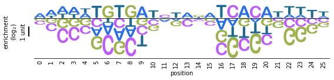

Examples
========

Some static text in Examples.rst

Quick Demo
----------

Make and enrichment logo
~~~~~~~~~~~~~~~~~~~~~~~~
::

	# Import LogoMaker
	import logomaker
	
	logo = logomaker.make_logo(fasta_file='data/crp_sites.fasta', 
                           logo_type='enrichment',
                           axes_type='scalebar',
                           show_scalebar=True,
                           xtick_spacing=1,
                           draw_now=True)
                           
