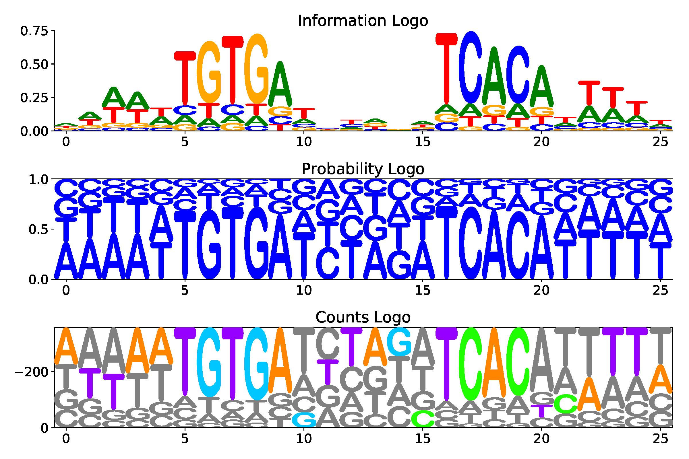
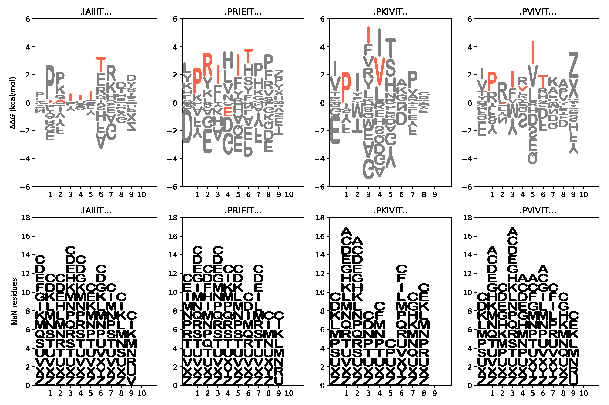
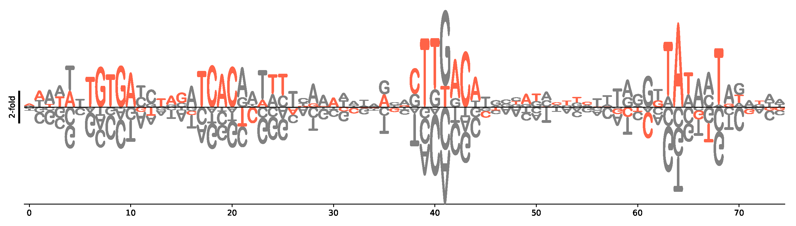
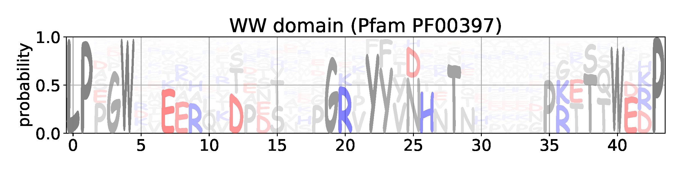

.. logomaker documentation master file, created by
   sphinx-quickstart on Sun Aug 19 19:08:24 2018.
   You can adapt this file completely to your liking, but it should at least
   contain the root `toctree` directive.

=============================================================================
Logomaker: Software for the visualization of sequence-function relationships
=============================================================================

*Written by Ammar Tareen, William Ireland, and Justin B. Kinney.*

.. raw:: html

    <h1>Under Active Development</h1>

We introduce LogoMaker, a lightweight utility for generating publication-quality sequence
logos. LogoMaker can generate logos from a variety of data including user-supplied motifs, sequence
alignments, enrichment data from massively parallel reporter assays or deep mutational scanning
experiments, and so on. A large number of optional parameters enable a high level of customization.
This functionality can be accessed via a web interface, from the command line, or from within Python.
When using the Python API, logos are generated as native matplotlib axes objects that are amenable to
subsequent customization and incorporation into multi-panel figures.

.. toctree::
   :maxdepth: 2
   :caption: Contents:

Examples
--------

 

   

  

   
   
Installation
------------

Logomaker can be installed from
`PyPI <https://pypi.python.org/pypi/logomaker>`_ using the pip package
manager (version 9.0.0 or higher). At the command line::

    pip install logomaker

The code for logomaker is open source and available on
`GitHub <https://github.com/jbkinney/logomaker>`_.   

Documentation
-------------

.. toctree::
   :maxdepth: 2

   examples
   make_logo

Indices and tables
==================

* :ref:`genindex`
* :ref:`modindex`
* :ref:`search`
